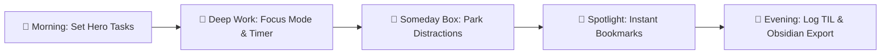

<div align="center">

# 🌿 Productive Tab

**A calm, minimalist new tab dashboard designed to eliminate digital noise and keep you focused on what truly matters.**

[](manifest.json)
[](manifest.json)
[](#-privacy--local-first)
[](LICENSE)

[✨ Overview](#-overview) • [🎯 Features](#-features) • [🚀 Installation](#-installation) • [📖 How to Use](#-how-to-use--daily-workflow) • [⌨️ Shortcuts](#-keyboard-shortcuts) • [🔒 Privacy](#-privacy--local-first)

</div>

---
## ✨ Overview

As a super lazy person. Saya selalu mikir gimana ya caranya agar saya bisa ga nunda2. 

"Saya mau berubah", i said that on every new year. <br />
Tapi akhirnya 1 tahun berlalu, tetap malas. Tetap menunda.<br /> 
2 tahun berlalu, ternyata masih sama. Ada progress tapi tiba2 ga keurus lagi<br />
Sampai 5 tahun berlalu akhirnya saya udah masuk awal 20 an. Saya berpikir: <br />

> *"wtf am I actually doing with my life?"*  
> Gada yang berubah bjir. 💀

Akhirnya saya buat **Productive Tab** (saat ini berbentuk ekstensi browser). Tujuannya simpel: **begitu buka browser, langsung disambut oleh 1 fokus utama hari ini, tanpa distraksi.** Kalau saya bilang hari ini mau kerjain A, ya selesaikan A, bukan banting setir ke B, C, sampai Z.

Ekstensi ini adalah *personal journey* saya untuk terus mencari sistem yang paling masuk akal buat orang yang gampang terdistraksi.

So, welcome. Dan selamat berjuang buat kita semua. 🤝

> 💬 **Punya pertanyaan, ide fitur, atau feedback?**  
> Feel free to reach me at Instagram: [@dollong.id](https://www.instagram.com/dollong.id) or just open an [Issue](../../issues) on this repo. Thx! :)

> Kalau udah ga sabar installnya gimana, [bisa tekan ini](#-installation)

---

## 🎯 Features

### 🏆 Central Hero Todo List
* **Intentional Focus:** Keep your primary daily tasks front and center — the hero of your dashboard.
* **Stopwatch Tracking per Task:** Track real elapsed time spent on individual tasks.
* **Subtasks & Priority Tags:** Break down complex goals and assign priority levels with clean visual tags.
* **📅 Google Calendar Integration:** Schedule tasks into your Google Calendar in 1 click.
* **📋 1-Click Obsidian Markdown Export:** Instantly copy your completed tasks formatted cleanly for your Obsidian Daily Notes.

### 🔖 Frosted Bookmark Spotlight (`Ctrl + B` / `Cmd + B`)
* **Raycast / Spotlight-Inspired Finder:** Search through your native browser bookmarks instantly with fuzzy search or browse folder trees with dual-pane navigation.
* **Dual-Pane Column Layout:** Left panel displays folder hierarchy; right panel displays links with real-time website favicons.
* **Full Keyboard Navigation:** Browse folders and open links effortlessly using `↑`/`↓`/`←`/`→` arrow keys and `Enter`.
* **Zero Visual Clutter:** Keep your browser bookmark bar completely hidden until you summon it.

### 🧠 Daily Learning Log (TIL & Insight Capture)
* **Daily Learning Accountability:** Dynamic counter badge (`⏳ Needs Learning` vs `✓ X Learned`) encouraging you to capture at least 1 new insight every day.
* **Dynamic Tag Placeholders:** Instant prompt cues when clicking tags (`🧠 TIL` → *"Today I learned..."*, `💡 Insight` → *"I just realized that..."*, `📖 Quote`, `✨ Term`, `🛠️ Method`).
* **Interactive Tag Filter Bar:** Filter insights by category with real-time counters.
* **📋 1-Click Obsidian Export:** Export all daily learnings into structured Markdown with auto-hashtagging ready for your Second Brain.

### 🌱 Someday Box (Idea Backlog)
* **Distraction-Free Idea Parking:** Capture sudden ideas, future tasks, and long-term backlog items without cluttering today's active Todo list.
* **🚀 1-Click "Move to Today":** Promote any backlog task directly into today's central Todo list whenever you're ready.
* **🔀 Drag & Drop Reordering:** Reorder your backlog priorities with smooth drag indicators.
* **Tag Categorization:** Organize with tags like `💡 Idea`, `📚 Learn`, `📅 Next Week`, `🎯 Project`, or custom tags.

### 🌿 Milestone Habit Tracker
* **Build Daily Consistency:** Track daily streaks and recurring habits with rewarding weekly progress bars.
* **Streaks & Accountability:** Keep the streak alive every day without overwhelming setup.

### 🔗 Quick Links App Dock
* **Squircle App Dock (2x3 Grid):** Pin your 6 most essential daily tools and URLs.
* **Searchable Icon & Emoji Picker:** 180+ curated icons with instant keyword search or direct emoji input.
* **Auto Favicon Fallback:** Automatically fetches high-resolution site favicons.

### ⏳ Focus & Pomodoro Timer / Stopwatch
* Integrated customizable countdown and focus timers to power your deep work sessions right inside the tab or via the floating dock.

### 👁️ Global Focus Mode & Widget Minimizer
* **1-Click Distraction Shield (`👁️` FAB):** Instantly collapse/hide all side widgets to leave only the central Todo List on screen.
* **Individual Widget Collapse (`[─]`):** Collapse any widget into a compact ~38px translucent glass bar.

### 📝 Scratchpad Quick Notes
* Lightweight, auto-saving notepad for temporary clipboard snippets, prompt templates, or temporary scratchpad notes.

### 🪟 Aesthetic Frosted Glass Customizer
* **Curated Wallpapers:** Includes Dark Cyber Mesh, Aurora Borealis, Deep Space, Night Mountain, Dark Ribbon, Dark Cubes, Teal Clouds, and Minimal Dark presets.
* **Custom Backdrops:** Upload your own high-res images or set any Unsplash image URL.
* **Fine-Tuned Ambiance:** Adjust overlay dimming and background blur sliders to match your lighting setup.

---

## 🚀 Installation

Because **Productive Tab** is not yet published on the Chrome Web Store, you can install it manually in **less than 1 minute** using **Developer Mode / Load Unpacked**.

> [!TIP]
> **💡 We strongly recommend installing via Git (Method A):**  
> Using Git makes future updates effortless. Whenever a new feature or bugfix is released, you simply run `git pull` inside the folder and click reload in your browser. No need to re-download, delete, or re-extract `.zip` files manually!

### Step 1: Download the Extension Files

Choose **one** of the methods below:

* **Method A (Using Git — Strongly Recommended ⭐):**
  ```bash
  git clone https://github.com/doltonsedward/productive-tab.git
  ```

* **Method B (Download ZIP):**
  1. Click the green **`Code`** button at the top of this GitHub repository.
  2. Select **`Download ZIP`**.
  3. Extract the downloaded `.zip` file into a permanent folder on your computer (e.g. `Documents/productive-tab`).

---

### Step 2: Load into Your Browser

Works on **Google Chrome**, **Brave**, **Microsoft Edge**, **Opera**, **Vivaldi**, and any Chromium-based browser:

1. Open your browser and navigate to the extensions page:
   * **Chrome:** `chrome://extensions`
   * **Brave:** `brave://extensions`
   * **Edge:** `edge://extensions`
   * **Opera:** `opera://extensions`
2. Toggle on **"Developer mode"** (usually located in the top-right corner).
3. Click the **"Load unpacked"** (*Muat yang belum dibongkar*) button in the top-left toolbar.
4. Select the `productive-tab` folder containing `manifest.json`.
5. Open a new tab (`Ctrl + T` on Windows/Linux or `Cmd + T` on macOS).
6. 🎉 **Done! Welcome to your distraction-free workspace.**

---

### 🔄 How to Update to Newer Versions

When updates are pushed to this repository:
* If you used **Git**: Run `git pull` inside the folder.
* If you downloaded **ZIP**: Download the new ZIP and replace the folder files.
* Then go to your browser's extensions page (`chrome://extensions`) and click the **Reload (🔄)** icon on the Productive Tab card.

---

## 📖 How to Use & Daily Workflow

Here is a recommended daily routine to get the most out of Productive Tab:



1. **🌅 Morning (Set Intention & Hero Tasks):**
   * Open a new tab and type your 1–3 most critical tasks for the day in the center **Todo Input**.
   * Check off your daily **Milestone Habits**.

2. **🚀 Mid-Day (Deep Work & Defeating Distractions):**
   * Start a **Task Stopwatch** by clicking the timer icon next to your active task.
   * Toggle **Focus Mode (`👁️`)** in the bottom-right corner to hide side widgets for a pure, distraction-free view.
   * When sudden ideas or side quests pop up, don't let them derail your focus: quickly dump them into the **Someday Box**.

3. **🔖 Fast Navigation (Spotlight Finder):**
   * Whenever you need a tool or documentation link, press `Ctrl + B` (or `Cmd + B`) to summon the **Bookmark Spotlight** without cluttering your screen with a static bookmark bar.

4. **🌙 Evening (Capture Learnings & Second Brain Sync):**
   * Open the **Daily Learning Log** widget and jot down what you learned today (`🧠 TIL`, `💡 Insight`, `🛠️ Method`).
   * Click **📋 Copy to Obsidian** to export your completed tasks and learnings directly into your Obsidian Daily Notes.
   * Periodically export a backup file via **Settings (⚙️) → Data → Export JSON**.

---

## ⌨️ Keyboard Shortcuts

| Shortcut | Action | Scope |
| :--- | :--- | :--- |
| `Ctrl + B` / `Cmd + B` | Open / Close Bookmark Spotlight Finder | Global |
| `↑` / `↓` | Navigate items in list / spotlight | Bookmark Spotlight |
| `←` / `→` | Switch between Folders and Links panes | Bookmark Spotlight |
| `Enter` | Open selected bookmark in a new tab | Bookmark Spotlight |
| `Esc` | Close open modal, settings drawer, or spotlight | Global |

---

## 🔒 Privacy & Local-First

* 🛡️ **Zero Telemetry & Tracking:** Absolutely no analytics, cookies, tracking scripts, or data sent to external servers.
* 💾 **100% Local Storage:** All tasks, notes, habits, settings, and widgets live strictly on your machine via `chrome.storage.local` and `localStorage`.
* 📦 **Data Freedom (JSON Backup & Restore):** You own your data. Export your entire dashboard state into a single `.json` file anytime, and restore it on any other browser or machine in 1 click.

---

## 🛠️ Architecture & Tech Stack

* **Runtime:** Chrome Extensions Manifest V3 (Compatible with Chrome, Brave, Edge, Opera, Vivaldi).
* **Core:** Pure Vanilla JavaScript (ES6+), HTML5.
* **Styling:** Modern CSS3 (Custom Properties, Glassmorphism, CSS Grid & Flexbox).
* **Dependencies:** **Zero runtime dependencies / zero build tools required.** Ultra-lightweight (< 2MB including wallpapers), instant load time on every new tab.

---

## 🤝 Contributing & Feedback

Contributions, ideas, and bug reports are warmly welcome!

1. Fork the Project.
2. Create your Feature Branch (`git checkout -b feature/AmazingFeature`).
3. Commit your Changes (`git commit -m 'feat: Add some AmazingFeature'`).
4. Push to the Branch (`git push origin feature/AmazingFeature`).
5. Open a Pull Request.

---

## 📄 License & Creator

Distributed under the **MIT License**. See `LICENSE` for more information.

* **Created with passion by:** [Edward Doltons](https://github.com/doltonsedward)
* **Instagram:** [@dollong.id](https://www.instagram.com/dollong.id)