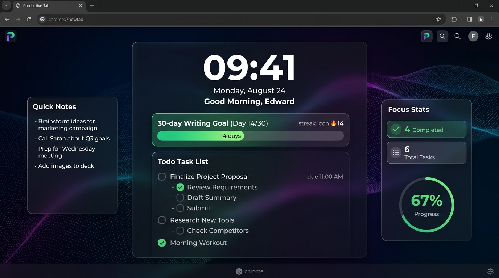
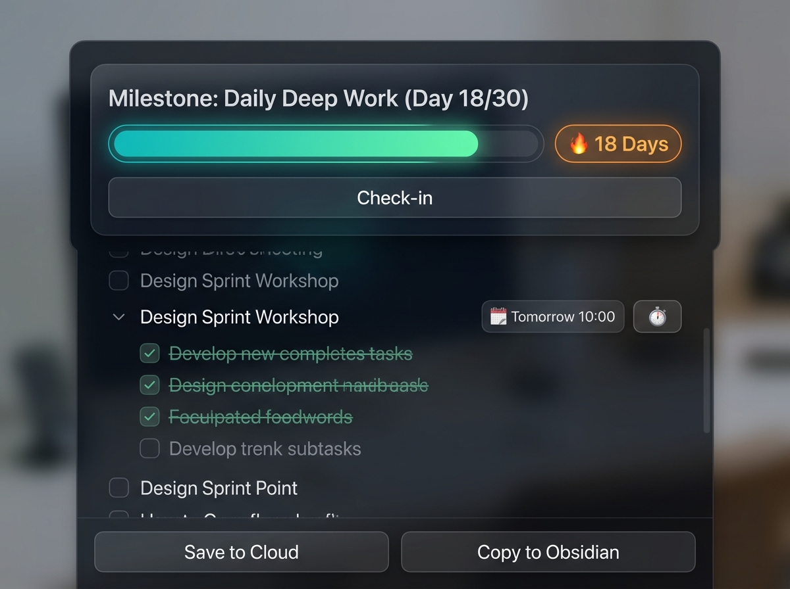
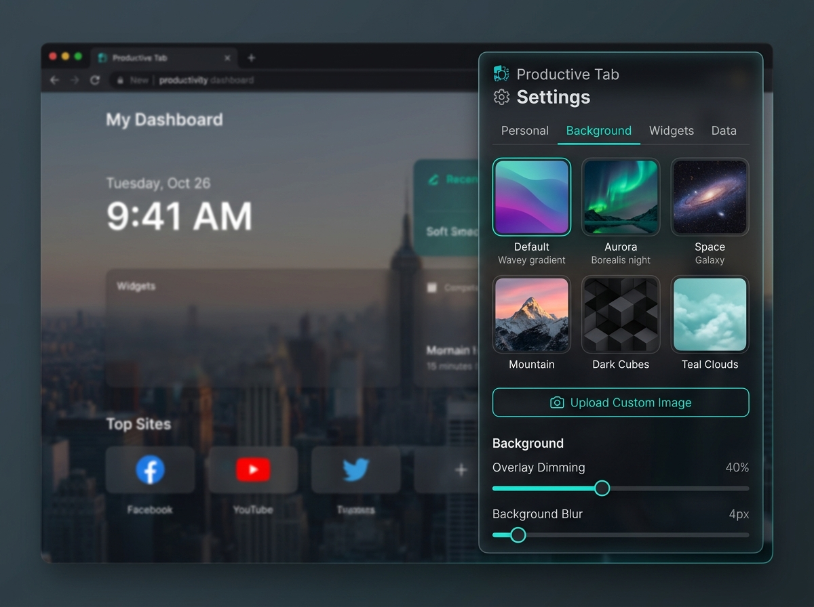
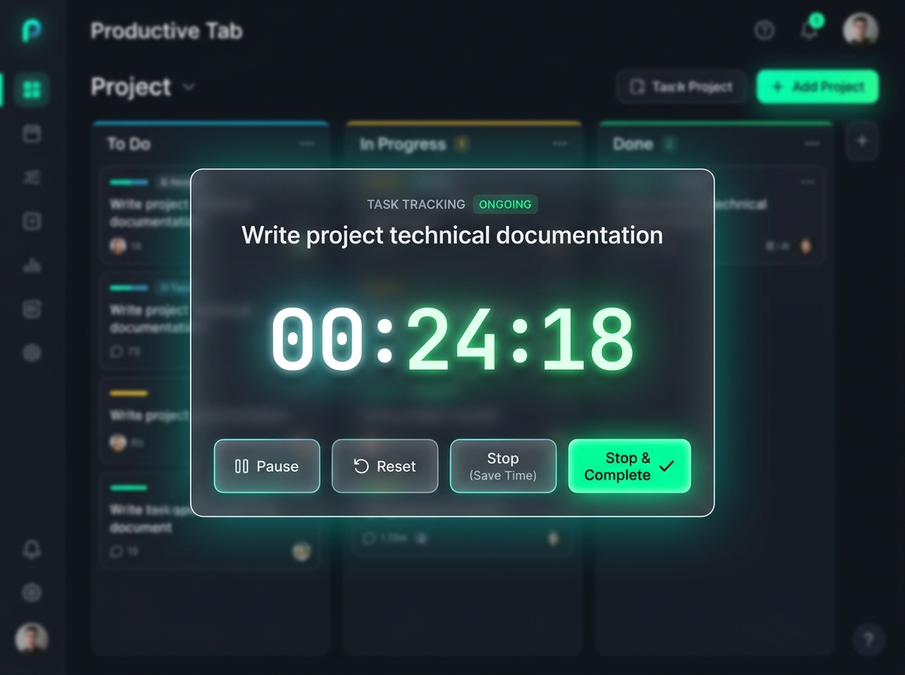
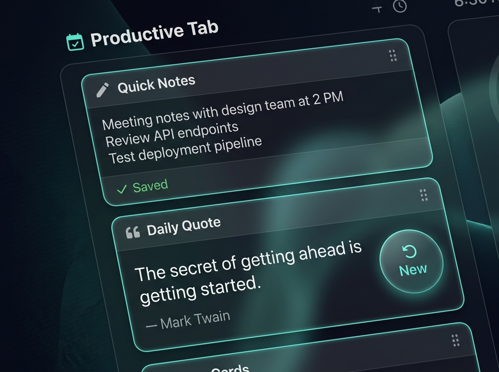

<div align="center">

# ⚡ Productive Tab

**A sleek, minimalist, and hyper-productive New Tab dashboard for Chromium browsers.**  
*Replace standard new tabs with a glassmorphic focus center featuring todo checklists, milestone habit streaks, dual-slot widgets, task-level time tracking, and seamless Obsidian & Google Calendar workflows.*

---

[](https://developer.chrome.com/docs/extensions/mv3/intro/)
[](https://developer.mozilla.org/en-US/docs/Web/JavaScript)
[](https://developer.mozilla.org/en-US/docs/Web/CSS)
[](LICENSE)

<br/>

<!-- ========================================== -->
<!-- HERO PREVIEW SCREENSHOT                    -->
<!-- Place your main screenshot at: assets/preview-hero.png -->
<!-- ========================================== -->
<p align="center">
  
</p>
<p align="center"><em>💡 Replace this image with your full dashboard screenshot at <code>assets/preview-hero.png</code></em></p>

</div>

---

## 🌟 Highlights

- 🎯 **Centered Focus Todo & Subtasks** — Drag-and-drop task reordering, nested subtask accordions, quick inline double-click editing, and hide/show completed filters.
- 🏆 **Milestone Habit Tracker** — Build multi-day streaks (e.g. 30-day writing goal), strike warning system for missed days, and daily reflection prompts.
- ⏱️ **Dual Timer & Task-Level Stopwatch** — Track accumulated time per individual task or use the global floating countdown timer & stopwatch with background tab sync.
- 🧩 **Dual-Column Modular Widgets** — Customizable left and right workspace slots (Quick Notes, Daily Quotes, Focus Stats, Embedded Timer) with smooth drag-and-drop repositioning.
- 📅 **Google Calendar Quick Scheduling** — 1-click modal to schedule tasks with prefilled date, time, and custom duration directly into Google Calendar.
- 📋 **Obsidian Markdown Export** — Copy structured daily todo summaries formatted with checklist checkboxes, time durations, and milestone status into your Obsidian notes.
- 🎨 **Glassmorphism & Theme Customization** — Sleek dark-mode aesthetic with 8 curated preset wallpapers, custom URL / local image uploads, adjustable dimming overlay, and blur intensity.
- 🔒 **100% Private & Offline First** — Zero external tracking, no login required, zero analytics, with instant JSON export/import for full data backup.

---

## 📸 Visual Tour

<div align="center">
<table>
  <tr>
    <td width="50%" align="center">
      <!-- Screenshot: Milestone Tracker & Todo -->
      <br/>
      <b>Todo List & Milestone Habit Streak</b><br/>
      <em>(Place screenshot at: <code>assets/preview-todo.png</code>)</em>
    </td>
    <td width="50%" align="center">
      <!-- Screenshot: Settings Side Drawer -->
      <br/>
      <b>Settings Drawer & Background Controls</b><br/>
      <em>(Place screenshot at: <code>assets/preview-settings.png</code>)</em>
    </td>
  </tr>
  <tr>
    <td width="50%" align="center">
      <!-- Screenshot: Task Tracking Modal -->
      <br/>
      <b>Task-Level Stopwatch Tracking</b><br/>
      <em>(Place screenshot at: <code>assets/preview-task-timer.png</code>)</em>
    </td>
    <td width="50%" align="center">
      <!-- Screenshot: Widget Drag & Drop -->
      <br/>
      <b>Dual-Column Modular Widgets</b><br/>
      <em>(Place screenshot at: <code>assets/preview-widgets.png</code>)</em>
    </td>
  </tr>
</table>
</div>

---

## 🚀 Quick Installation Guide

You can load this extension in any Chromium-based browser (**Google Chrome**, **Brave**, **Microsoft Edge**, **Arc**, **Opera**, **Vivaldi**) in less than 1 minute:

### Step 1: Clone the Repository
Open your terminal / command prompt and run:
```bash
git clone https://github.com/doltonsedward/productive-tab-extension.git
cd productive-tab-extension
```

### Step 2: Open Extensions Management
In your browser address bar, navigate to:
- **Google Chrome / Brave / Arc:** `chrome://extensions`
- **Microsoft Edge:** `edge://extensions`

### Step 3: Enable Developer Mode
Toggle the **Developer mode** switch (usually located at the **top-right corner** of the Extensions page).

```
┌─────────────────────────────────────────────────────────────┐
│ Extensions                              [Developer mode: ON]│
└─────────────────────────────────────────────────────────────┘
```

### Step 4: Load Unpacked Extension
1. Click the **"Load unpacked"** button in the top-left corner.
2. Select the cloned `productive-tab` (or `productive-tab-extension`) folder.
3. Open a **New Tab** (`Ctrl + T` or `Cmd + T`) to launch your new dashboard!

---

## 🧩 Widget Ecosystem

The workspace layout supports up to **2 widgets on the Left Column** and **2 widgets on the Right Column**:

| Widget | Icon | Description |
| :--- | :---: | :--- |
| **Quick Notes** | 📝 | Auto-saving scratchpad for quick thoughts, scratch calculations, and links. |
| **Daily Quote** | 💡 | Curated motivational & mindset quotes with an on-demand refresh button. |
| **Focus Stats** | 📊 | Real-time productivity metrics: Completed tasks, progress %, and total focus time. |
| **Timer Panel** | ⏱️ | Mini embedded timer panel synced directly with the global stopwatch & timer. |

> **Pro Tip:** Drag widgets using the handle (`⣿`) to swap their positions, or use the header buttons (`⇅` to swap top/bottom, `⇄` to send across to the other side).

---

## ⌨️ Shortcuts & Interaction Tips

- **Add New Task:** Type in the main input and press `Enter`.
- **Add Subtask:** Expand the accordion (`▶`) and type in the subtask field + `Enter`.
- **Edit Inline:** Double-click on any subtask or click `✏️` to edit task descriptions.
- **Reorder Tasks:** Click and drag any task item up or down.
- **Track Time:** Click `⏱️` on any task to start a dedicated stopwatch for that task.
- **Google Calendar:** Click `📅` on any task to open the prefilled calendar scheduling modal.
- **Copy to Obsidian:** Click `📋 Copy to Obsidian` at the bottom of the todo list to copy your markdown daily report.

---

## 🛠️ Tech Stack & Architecture

- **Manifest V3** compliant extension architecture.
- **Pure Vanilla JS (ES6+)** — No heavy frameworks, zero runtime dependencies, instant sub-millisecond load times.
- **Modular Design System**:
  - `js/state.js` — Central state management & storage migration.
  - `js/clock.js` — Dynamic clock & greeting calculations.
  - `js/todo.js` — Core task engine, subtasks, drag & drop, Obsidian export.
  - `js/milestone.js` — Habit target engine, daily gap evaluation & reflection logic.
  - `js/widgets.js` — Dynamic widget registry & dual-slot layout engine.
  - `js/calendar.js` — Google Calendar template URL generator.
  - `js/timer.js` — High-precision timer & background visibility synchronization.
  - `js/settings.js` — Side drawer controller, JSON backup import/export.
- **Modern Vanilla CSS3** — Glassmorphism, backdrop filters, CSS Grid workspace layout, fluid responsive animations.

---

## 📁 Repository Structure

```
productive-tab/
├── manifest.json         # Extension Manifest V3 configuration
├── newtab.html           # Main dashboard HTML template
├── styles.css            # Master stylesheet aggregator
├── background/           # Built-in HD wallpaper presets
│   ├── default.png
│   ├── aurora.png
│   ├── mountain.png
│   ├── space.png
│   ├── dark-ribbon.jpg
│   ├── dark-cubes.jpg
│   └── teal-clouds.jpg
├── css/                  # Modular stylesheets
│   ├── base.css          # Design system tokens, loader & toasts
│   ├── clock.css         # Typography & time section styling
│   ├── milestone.css     # Milestone card & streak badges
│   ├── todo.css          # Todo list, subtasks & actions
│   ├── timer.css         # Floating timer & tracking modals
│   ├── widgets.css       # Workspace grid & widget cards
│   └── settings.css      # Slide drawer & settings controls
└── js/                   # Modular JavaScript architecture
    ├── state.js          # LocalStorage persistence & defaults
    ├── clock.js          # Time ticker & greeting generator
    ├── milestone.js      # Milestone & habit streak logic
    ├── todo.js           # Todo operations & Obsidian export
    ├── calendar.js       # Google Calendar scheduling
    ├── timer.js          # Stopwatch, countdown & background sync
    ├── widgets.js        # Widget registry & drag-and-drop
    ├── settings.js       # Settings controller & JSON backup
    └── app.js            # Main bootstrap entry point
```

---

## 💾 Backup & Data Privacy

- All your data is stored **locally on your device** inside your browser's `localStorage`.
- No servers, no telemetry, no tracking scripts.
- Use the **Data** tab in Settings to export all your todos, milestones, notes, and preferences into a standalone `.json` backup file anytime.

---

## 📄 License

This project is licensed under the **MIT License** — see the [LICENSE](LICENSE) file for details.

---

<div align="center">
  <b>Built with passion by <a href="https://github.com/doltonsedward">doltonsedward</a></b><br/>
  <sub>If you find this project helpful, feel free to star ⭐ the repository!</sub>
</div>
